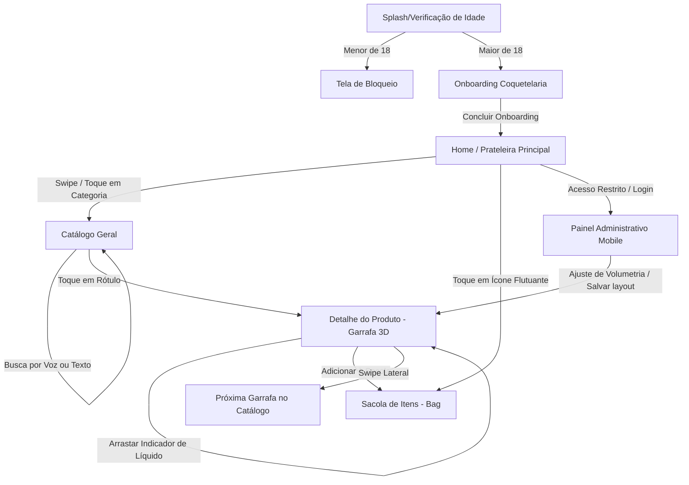

# Jornada de Navegação do Usuário: Redesenho Mobile do Acervo Bar

Este documento mapeia detalhadamente o fluxo de navegação, transições de tela e interações do usuário para a versão mobile (smartphone) do aplicativo **Acervo Bar**, redesenhada do zero com foco em uma experiência ultra-premium, tátil e minimalista.

---

## Estrutura de Fluxo Geral (Mapa de Telas)

---

## Detalhamento da Jornada de Navegação

### Etapa 1: A Entrada & Verificação de Maioridade (Age Gate)
*   **Estado Inicial (Splash):** A tela carrega com uma transição suave. O fundo é um gradiente suave "Tahoe Ice" ou "Canvas Mist" ligeiramente desfocado. No centro, o logotipo do bar surge com uma micro-animação de escala.
*   **O Desafio de Idade:** Uma janela flutuante em formato de cartão fosco (*glassmorphism*) surge de baixo para cima via efeito de mola física (*spring physics*).
    *   **Ação do Usuário:** O usuário visualiza três campos numéricos integrados (`DD` | `MM` | `AAAA`).
    *   **Comportamento do Sistema:** Ao digitar o segundo número do dia, o foco do teclado virtual salta automaticamente para o mês. Ao digitar o segundo dígito do mês, salta para o ano.
    *   **Validação Reativa:**
        *   *Se menor de 18 anos:* O cartão vibra levemente (haptic feedback simulado por animação), exibe a mensagem "Idade mínima não atingida" e impede a navegação.
        *   *Se maior de 18 anos:* O cartão se dissolve suavemente enquanto o desfoque do fundo desaparece, revelando a primeira tela de Onboarding.

---

### Etapa 2: Onboarding (A Experiência do Bar Secreto)
*   **Apresentação em Carrossel:** Duas telas sequenciais de alta costura mixológica para contextualizar o usuário.
    *   **Tela 1 (Elegância):** Foto conceitual de coquetelaria minimalista ocupando 50% da tela superior. Texto curto de boas-vindas focado em "bebidas premium" e "preços justos baseados na volumetria".
        *   *Navegação:* Botão inferior transparente de vidro com chamada "Próximo".
    *   **Tela 2 (A Experiência):** Foco nas prateleiras virtuais e na descoberta de sabores através dos sentidos.
        *   *Navegação:* Botão inferior "Começar a Explorar" que redireciona para a Home do aplicativo.

---

### Etapa 3: Home / A Prateleira Principal
*   **Primeira Impressão:** A tela é limpa, dominada por uma tipografia serifada elegante e um banner dinâmico com garrafas em alta definição dispostas em formato de grelha inclinada e flutuante.
*   **Menu Superior Minimalista:** O logotipo personalizado carregado pelo administrador fica no canto superior esquerdo; no canto superior direito, um botão flutuante de Sacola (Bag) com indicador numérico discreto de itens.
*   **Busca e Filtro Rápido:**
    *   **Ação do Usuário:** Um toque no campo "Buscar no acervo" expande uma barra de pesquisa flutuante.
    *   **Busca por Voz:** Um ícone de microfone ao lado da busca permite que o usuário fale o que deseja (ex: *"quero um whisky amadeirado"*). O sistema processa o áudio e aplica os filtros correspondentes de sabor de forma imediata.

---

### Etapa 4: Navegação pelo Catálogo (Prateleira de Garrafas)
*   **Carrossel Horizontal de Categorias:** Logo abaixo da busca, etiquetas deslizantes horizontais como *Licor*, *Whisky*, *Gin*, *Amaro*, *Vermouth* e *Cachaça*.
    *   *Navegação:* Um toque em uma categoria aplica uma transição de tela do tipo *Shared Layout* (os cards de produtos antigos deslizam para fora e os novos surgem de forma ascendente).
*   **Grelha de Produtos:** Cards com fundo suave translúcido contendo a foto da garrafa em transparência absoluta, o nome do rótulo, o país de origem e o preço dinâmico atual.
    *   *Selo de Estado:* Se a garrafa estiver aberta, exibe uma etiqueta contendo o percentual restante (ex: `70% restante`). Se estiver lacrada, exibe o selo `Lada`.

---

### Etapa 5: Detalhe do Produto (Focalização e Interação Tátil)
Esta é a tela de maior interação do aplicativo. O usuário entra aqui ao tocar em qualquer garrafa do catálogo.

*   **A Garrafa Flutuante:** A imagem da garrafa é renderizada em alta resolução no centro da tela. Atrás dela, há um anel 3D elíptico inclinado brilhante que emana uma cor correspondente ao líquido da bebida (ex: âmbar para whisky, vermelho para Campari).
*   **Jornada de Swipe entre Garrafas (Visual Infinito):**
    *   **Ação do Usuário:** O usuário pode fazer um gesto de *swipe* lateral (deslizar o dedo para a esquerda ou direita) diretamente na garrafa.
    *   **Transição de Tela:** A garrafa atual rotaciona 3D no próprio eixo Y e sai de cena, enquanto a garrafa seguinte do acervo entra girando em sentido oposto. Os textos de nome, descrição e preço mudam instantaneamente com um efeito de fade.
*   **Mostrador Dinâmico de Líquido (Liquid Gauge):**
    *   Para garrafas abertas, uma pílula flutuante (*glassmorphism*) mostra uma minicápsula com o líquido restante e o texto com a porcentagem e mililitros exatos restantes.
    *   **Interface Admin (Ajuste Tátil):** O administrador pode arrastar esta pílula de medição livremente pela tela para posicioná-la onde achar mais elegante no layout da garrafa específica.
*   **Compartilhamento Sofisticado:** Um botão flutuante abre um menu de ação elegante no canto inferior, permitindo copiar o link ou enviar o rótulo diretamente para o WhatsApp ou e-mail de um amigo.
*   **Botão de Conversão (Adicionar ao Pedido):** Um botão na parte inferior com efeito holográfico permite adicionar a dose/garrafa para a sacola.

---

### Etapa 6: Sacola de Itens (Bag) & Checkout
*   **Acesso:** O usuário clica no ícone da sacola disponível no canto superior direito de qualquer tela principal.
*   **Visualização do Pedido:** Uma tela estilo "gaveta tátil" desliza de baixo para cima, cobrindo 90% da tela.
    *   Exibe a lista de garrafas selecionadas, seus volumes correspondentes e o preço proporcional calculado de cada uma.
    *   Mostra o somatório finalizado do pedido.
*   **Ação de Saída:**
    *   O botão principal "Enviar Pedido via WhatsApp" gera uma mensagem formatada de forma editorial detalhando a lista dos rótulos desejados, a volumetria solicitada e o valor final dinâmico direto para o contato do dono do acervo.

---

### Etapa 7: Modo de Edição Administrativa (Gestão Rápida)
*   **Acesso:** Protegido por autenticação. O administrador acessa um painel mobile minimalista.
*   **Ações na Tela de Detalhes:**
    *   Ao alternar para o modo admin, os elementos na tela de detalhes (como o título da categoria e o medidor de líquido) ganham uma borda pontilhada discreta indicando que podem ser arrastados.
    *   O administrador reposiciona fisicamente os elementos arrastando-os com o dedo para que se adequem perfeitamente ao formato da garrafa de fundo (que varia de altura e largura).
    *   Ao soltar o dedo, a nova coordenada é transmitida ao banco de dados em segundo plano, atualizando o layout para todos os usuários comuns.
*   **Controles de Entrada:** Controles deslizantes deslizáveis pelo polegar (*sliders*) para regular o percentual do nível de abertura da garrafa (de 0 a 100%).
